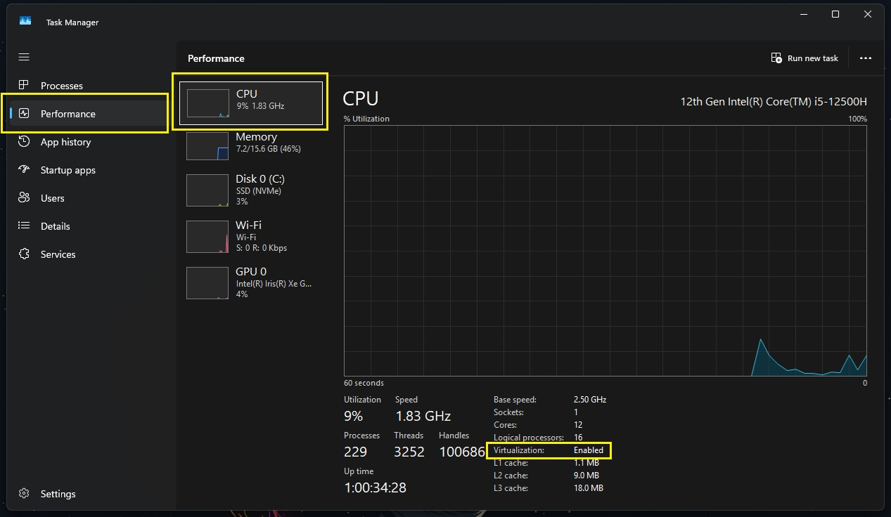
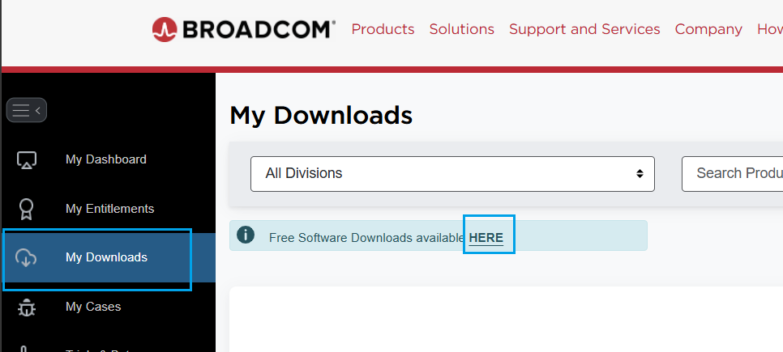
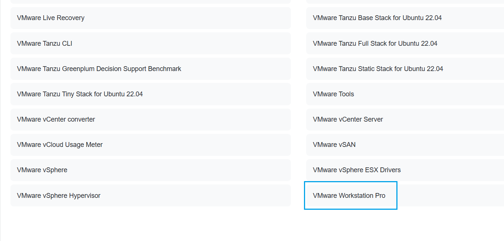
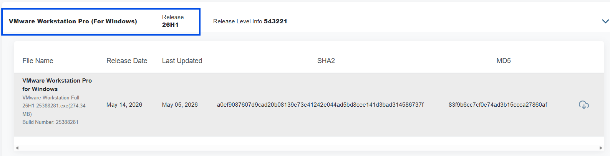
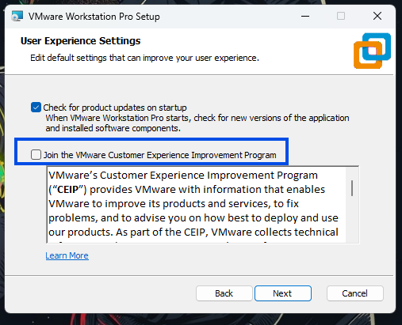

# VMware Workstation Pro Installation Lab

## Why Install VMware First?

I chose to install **VMware Workstation Pro** before setting up GNS3 because it acts as the ***base virtualization platform*** for all my labs.  
The reason is that during GNS3 setup, it will detect VMware and make configuration easier. If I install GNS3 first and VMware later, I might need to reconfigure some settings manually — which is extra work I’d rather avoid.  

By installing VMware first, I make sure my environment is ready and smooth for the next steps.

---

## Why VMware Workstation Pro?
- Reliable virtualization platform for running multiple VMs.  
- Easy integration with networking labs (like GNS3).  
- Good balance of performance and usability for practice environments.  

---

## Pre‑Installation (Windows Host)

First things first — before installing **VMware Workstation Pro** or any kind of virtualization base, you have to make sure you computer has **virtualization enabled**.  

Since I’m using **Windows OS**, here’s what I did:

1. Pressed **Ctrl + Shift + Esc** to open Task Manager → went to the **Performance tab → CPU** to check if Virtualization was Enabled.  
   - In my case, it was already enabled (you can see it under CPU details).
      

## If virtualization is disabled, you’ll need to enable it via BIOS/UEFI. Follow these steps:

1. **Restart your PC** and press the BIOS/UEFI access key repeatedly during boot.  
   - Common keys: **F2, F10, F12, Delete, or Esc** (varies by manufacturer).  
   
   **Alternative method (Windows):**  
   - Hold **Shift** while selecting **Restart**.
      
2. Go to **Troubleshoot → Advanced options → UEFI Firmware Settings**.  

3. **Inside BIOS/UEFI:**  
   - Navigate to **Advanced / CPU Configuration**.  
      - For Intel CPUs: enable **Intel Virtualization Technology (VT‑x)**.  
      - For AMD CPUs: enable **SVM Mode**.  

4. **Save changes and exit BIOS/UEFI** (usually by pressing **F10** and confirming).  

5. **After reboot:**  
   - Open Task Manager again (**Ctrl + Shift + Esc → Performance tab → CPU**)  
   - Confirm that **Virtualization: Enabled** is now displayed.  

With virtualization enabled, you’re ready to proceed with installing VMware Workstation Pro.

---

## Installation Steps

Follow these steps to install **VMware Workstation Pro** on Windows:

1. **Download Installer**  
   - Go to the official VMware website.  
   - To download the latest VMware Workstation Pro installer for Windows, you’ll need to create a **Broadcom account**.
   - Once logged in, click **My Downloads → Here**, then search for **VMware Workstation Pro** in the list.
   
     

     

   - Choose the version you want (at the time of creating this repo, the latest was **26H1**, so that’s what I installed).

     
     
   - You’ll be redirected to another page — accept the **Terms and Conditions** before the download starts.  

3. **Run Installer**  
   - Double‑click the `.exe` file.  
   - Follow the wizard prompts:  
     - Accept the license agreement  
     - Choose installation directory (default is fine)  
     - I didn’t select the **Join Customer Experience Improvement Program** option
    
       

4. **Create Shortcuts**  
   - Select whether you want desktop/start menu shortcuts.  

5. **Click Install**  
   - Start the installation process and wait for it to complete.  

6. **Finish Setup**  
   - Complete the installation.  
   - Restart your PC if prompted.  

---

## 🔧 Post-Installation Setup

### Create Your First VM
1. Open **VMware Workstation Pro**.  
2. Click **Create a New Virtual Machine**.  
3. Choose **Typical (recommended)**.  
4. Select your ISO file (e.g., Ubuntu Server).  
5. Configure VM settings (RAM, CPU, disk size).  
6. Finish and power on the VM.  

---

## 📓 Notes
This lab is for **practice documentation only**.  
I’m using it to:  
- Learn how to set up virtualization environments.  
- Prepare a base VM for my other labs (GNS3, Wireshark, Zabbix).  
- Share reproducible steps for anyone following along.  

---

## 🚀 Next
- After VMware is installed, proceed to create Ubuntu VMs for Zabbix and Wireshark.  
- Document each lab in its own subfolder.  
